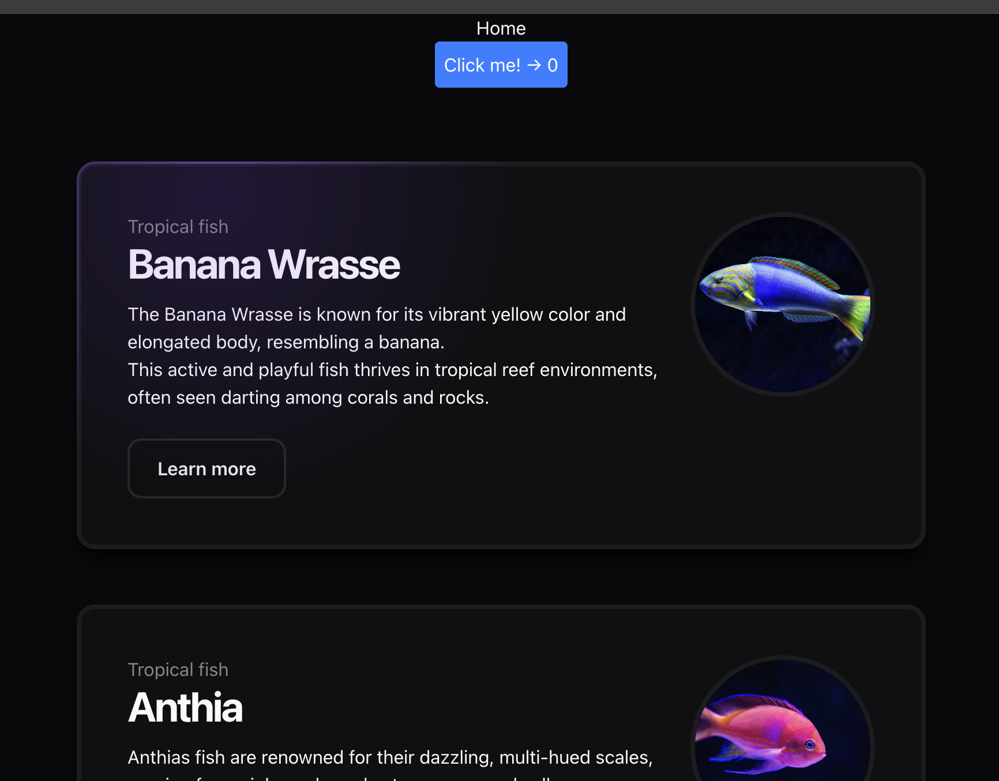

# rails8 + bun + react

```bash
rails new bun_react --css=tailwind --js=bun

# Add React and React DOM
bun add react react-dom
bun add -d @types/react @types/react-dom

# Add demo controller
rails g controller home

```

